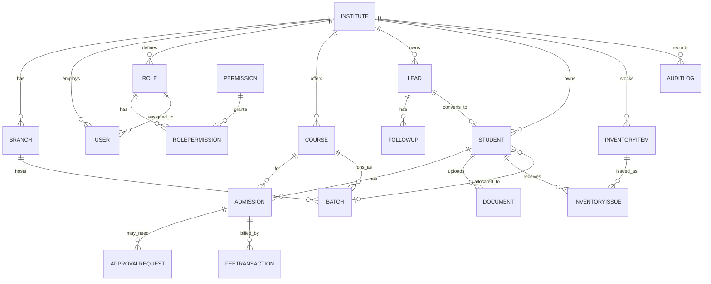

# EduFlow ERP — Entity Relationship Diagram

Source of truth for the schema is [`prisma/schema.prisma`](../prisma/schema.prisma). This diagram is a visual summary — regenerate it manually if models change significantly.

## Multi-tenancy

Every tenant-scoped table carries `instituteId`. Institute 4 can never see Institute 3's rows — this is enforced at the application layer (a Prisma Client Extension auto-injects `where: { instituteId }` using an `AsyncLocalStorage`-backed request context — see [`src/lib/tenant-context.ts`](../src/lib/tenant-context.ts) and [`src/lib/prisma.ts`](../src/lib/prisma.ts)), not by relying on developers to remember the filter on every query.

`User.instituteId` is nullable — a `null` value marks the Super Admin, who sits outside institute scoping entirely.

## RBAC (permission builder)

`Role` + `Permission` + `RolePermission` implement the checkbox-based permission builder — Institute Admin toggles `allowed` per role/permission from the UI, no code changes needed. `Permission.module` groups keys for the builder screen (e.g. all `Student.*` permissions render under a "Student" section).

## Approval workflow

`ApprovalRequest` is deliberately generic (`entityType` + `entityId`) rather than admission-specific, so future workflows (e.g. fee waivers) can reuse it. Today it's populated when an `Admission.scholarshipPercent` exceeds the institute's configured threshold.

## Audit log

`AuditLog` records `entityType` + `entityId` + `fieldChanged` + `oldValue` → `newValue`, written by a shared `logAudit()` helper (see [`src/lib/audit.ts`](../src/lib/audit.ts)) on every sensitive mutation (scholarship changes, fee edits, role/permission changes).
